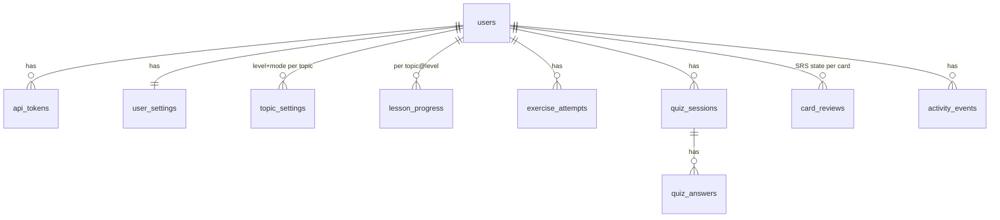

# Data model

Source of truth for the schema is `packages/db/src/schema.ts`; for content shapes it is
`packages/core/src/content.ts`. This document explains *why* the tables look the way they do and how
derived values are computed. Keep the three in sync; the schema files win on conflict.

## 1. Two stores

| Store | Holds | Identity | Mutability |
| --- | --- | --- | --- |
| `content/dist/bundle.json` | modules, topics, lessons, questions, flashcards | string IDs from folder/file names | immutable per build; `manifest.version` changes on every build |
| SQLite (`data/itmc.db`) | users, tokens, settings, progress, attempts, quiz sessions, card SRS state, activity log | ULIDs or composite natural keys | mutable |

The database never stores content text. It stores content **IDs**. If a lesson is renamed the ID
does not change (IDs come from slugs, not titles), so progress survives content edits. If a section
is deleted, `lessonCompletion()` ignores stale section IDs.

## 2. Entity relationship

Content entities (not tables) referenced by ID: Topic ← topic_settings, card_reviews.topic_id;
Lesson ← lesson_progress, exercise_attempts; Exercise ← exercise_attempts; Question ← quiz_answers;
Flashcard ← card_reviews.

## 3. Tables

### users, api_tokens
Single-user install seeds `usr_default` and one token from `AUTH_TOKEN`. Tokens are stored as SHA-256
hex, one row per device/label, optional expiry. The design already supports several users and several
devices so mobile needs no schema change.

### user_settings
`default_level` (default `rusty`: the user is experienced) and `default_mode` (default `manager`),
`daily_goal_minutes`. Applies to any topic without a `topic_settings` row.

### topic_settings — the level selector and mode toggle
PK `(user_id, topic_id)`. Holds the level and mode last chosen for that topic. Absent row means
"use defaults". Written by `PUT /api/settings/topics/:topicId`.

### lesson_progress — progress per module and level
PK `(user_id, lesson_id)` where `lesson_id = topicId@level`. Because the level is part of the key,
the same topic has up to three independent progress rows. `completed_sections` is a JSON array of
section IDs; `status` is `not_started | in_progress | completed`.

Why store section IDs rather than a percentage: the percentage depends on content that can change,
so it is derived at read time by `lessonCompletion()` against the current manifest.

### exercise_attempts
Append-only. `self_rating` 1..5 is the primary signal (exercises are not auto-graded);
`submission` keeps code or notes for the user to look back on. Multiple attempts per exercise are
expected.

### quiz_sessions, quiz_answers
A session is created with its `question_ids` fixed up-front (so a refresh does not reshuffle),
then answers append, then `finish` writes counts. `scope_type/scope_id/level` allow "best score per
topic at level" and "recently wrong" queries.

### card_reviews — spaced repetition state
PK `(user_id, card_id)`. Columns mirror `CardState` in `packages/core/src/srs.ts` exactly, plus a
denormalised `topic_id` so "cards due per topic" is one indexed query. A card with no row is
"unseen" and is scheduled by `selectSessionCards()` after all due cards.

### activity_events
Append-only log: `lesson_viewed, section_completed, lesson_completed, exercise_attempted,
quiz_finished, card_reviewed, level_changed, mode_changed`. Used for streaks, minutes today, and the
resume list. Cheap to write; if an aggregate is ever wrong it can be rebuilt from here.

## 4. Derived values

All computed at read time, none stored.

| Value | Where | Rule |
| --- | --- | --- |
| Lesson completion | `core/progress.ts` `lessonCompletion` | completed ∩ manifest.sectionIds / sectionCount; `completed` status → 1 |
| Topic progress at a level | `topicProgress` | completion, status, quizBest, cardsDue, authored |
| Module progress per level | `moduleProgress().perLevel` | mean completion over *authored* topics at that level; counts of completed/started |
| Module progress on chosen path | `moduleProgress().selectedPath` | each topic at the level in `topic_settings` (or default) |
| Quiz best per (topic, level) | API dashboard | `max(correct_count / total_count)` over finished sessions where `scope_type='topic'` |
| Cards due | API | `count(*) from card_reviews where user_id=? and due_at <= now group by topic_id` |
| Streak days | API from activity_events | count consecutive local-date buckets ending today (or yesterday, so an evening study session is not lost at midnight) with at least one event of type in {section_completed, quiz_finished, card_reviewed, exercise_attempted} |
| Minutes today | API from activity_events | sum over today's events of a per-type credit: section_completed = the section's estimated share of `estimatedMinutes`, card_reviewed = 0.5, quiz_finished = 1 per question; cap at 240. This is a proxy, not tracking; document it in the UI as "approx." |
| Recent / resume | API | latest 5 `lesson_progress` rows by `last_viewed_at`, joined to manifest titles |

## 5. Idempotency (matters for mobile sync)

- `PUT settings` — full upsert, safe to replay.
- `POST .../viewed` — upsert; replaying only bumps `last_viewed_at`.
- `POST .../sections` — set-add; replaying is a no-op.
- `POST /review/cards` — **not** naturally idempotent (each call advances the schedule). A mobile
  client must send each rating once; if a client-generated `reviewId` is later needed, add it to the
  body and dedupe on `activity_events.ref_id`. Flag this as an ADR when mobile starts.
- `POST /quiz/:id/answers` — insert; dedupe on (session_id, question_id) in the route.

## 6. Portability

SQLite was chosen for zero-ops self-hosting (ADR-002). Every column type used (text, integer, real,
JSON-as-text, ISO timestamps as text) maps directly to Postgres via Drizzle if the app ever becomes
multi-user on a server. Avoid SQLite-only SQL in repositories.
